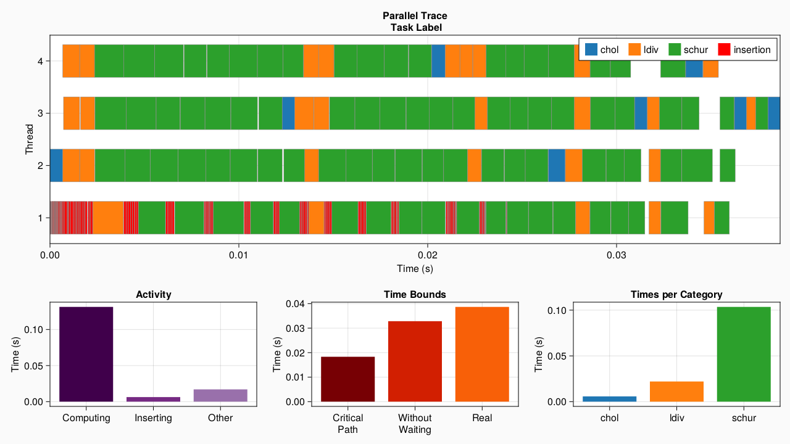
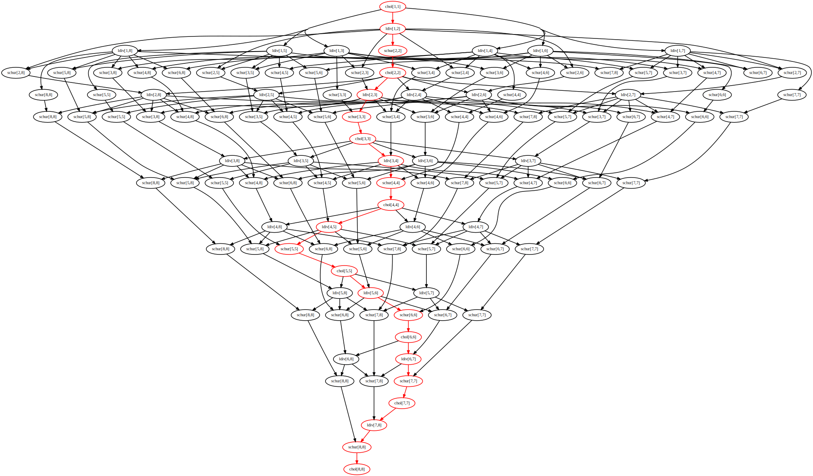

# [Examples](@id examples-section)

TODO: 
- add a description of the examples and more hardware info
- mention the effects of `tilesize` ahd `capacity` on the results of tiled factorization
- compare 'fork-join' approach to `HLU` to dataflow approach
 
## [Tiled Cholesky factorization](@id tiledcholesky-section)

The Cholesky factorization algorithm takes a symmetric positive definite matrix A and finds a lower triangular matrix L such that `A = LLᵀ`. The tiled version of this algorithm decomposes the matrix A into tiles of even sizes. At each step of the algorithm, we do a Cholesky factorization on the diagonal tile, use a triangular solve to update all of the tiles at the right of the diagonal tile, and finally update all the tiles of the submatrix with a schur complement.

So we have 3 types of tasks : the Cholesky factorization (I), the triangular solve (II), and the schur complement (III).  
If we have a matrix A decomposed in `n x n` tiles, then the algorithm will have `n` steps. It implies that the step `i ∈ [1:n]` do `1` time (I), `(i-1)` times (II), and `(i-1)²` times (III). So respectively `O(n)` (I), `O(n²)` (II), and `O(n³)` (III). We will compare this result with the "Times Per Category" part of the visualization.

The code of that algorithm, without parallelization, could be :

```julia
1   function cholesky!(A::TiledMatrix)
2       # Number of blocks
3       m,n = size(A)
4   
5       # Core
6       for i in 1:m
7           # Diagonal cholesky serial factorization (I)
8           serial_cholesky!(A[i,i])
9   
10          # Left blocks update (II)
11          L = adjoint(UpperTriangular(A[i,i]))
12          for j in i+1:n
13              ldiv!(L,A[i,j])
14          end
15  
16          # Submatrix update (III)
17          for j in i+1:m
18              for k in j:n
19                  Aji = adjoint(A[i,j])
20                  schur_complement!(A[j,k], Aji, A[i,k])
21              end
22          end
23      end
24  
25      # Construct the factorized object
26      return Cholesky(A.data,'U',zero(LinearAlgebra.BlasInt))
27  end
```

If we were to parallelize this code with DataFlowTasks, we would only have to wrap function calls within a `@dspawn`. We would have to change the lines 8, 13, and 20 (as well as add a synchronization point at the end) as follows :

```julia
1   function cholesky!(A::TiledMatrix)
2       # Number of blocks
3       m,n = size(A)
4   
5       # Core
6       for i in 1:m
7           # Diagonal cholesky serial factorization (I)
8           @dspawn serial_cholesky!(@RW(A[i,i]))
9   
10          # Left blocks update (II)
11          L = adjoint(UpperTriangular(A[i,i]))
12          for j in i+1:n
13              @dspawn ldiv!(@R(L), @RW(A[i,j])) 
14          end
15  
16          # Submatrix update (III)
17          for j in i+1:m
18              for k in j:n
19                  Aji = adjoint(A[i,j])
20                  @dspawn schur_complement!(@RW(A[j,k]), @R(Aji), @R(A[i,k]))
21              end
22          end
23      end
24      DataFlowTasks.sync()
25      # Construct the factorized object
26      return Cholesky(A.data,'U',zero(LinearAlgebra.BlasInt))
27  end
```

The tiled decomposition of matrices and the implementation of the cholesky tiled factorization is implemented in the package `TiledFactorization`, which can be usede with :

```julia
import Pkg
Pkg.add("https://github.com/maltezfaria/TiledFactorization.git")
```

The code below shows how to use the `cholesky!` function from this package, how to profile the program and get the most information from the visualization.

```julia
using DataFlowTasks
using DataFlowTasks: resetlogger!, plot, dagplot
using TiledFactorization
using TiledFactorization: cholesky!
using CairoMakie
using LinearAlgebra

# DataFlowTasks environnement setup
DataFlowTasks.enable_log()
sch = DataFlowTasks.JuliaScheduler(50)  # optionnal
DataFlowTasks.setscheduler!(sch)        # optionnal

# Context
tilesizes = 256
TiledFactorization.TILESIZE[] = tilesizes
n = 2048
A = rand(n, n)
A = (A + adjoint(A))/2
A = A + n*I

# Compilation
cholesky!(copy(A))

# Reset environnement
resetlogger!()
GC.gc()

# Real work to be analysed
cholesky!(A)

# Plot
plot(categories=["chol", "ldiv", "schur"])
```



Let's see how we can use this visualization to understand the program and its progress.

### Task colors : get an idea of the progress

We can see the algorithm's progress we described above : we have a first blue task (I), then O(n-i) orange (II), then O((n-i)^2) greens (III). We can see the repartition of the time depending on thoses categories we defined on the "Times per Category" plot. 

### Insertion Tasks

Red tasks represent the time spent inserting nodes in the graph. We specified a capacity of 50 nodes for the scheduler. It means if we have 50 nodes in the DAG, the scheduler will wait until some tasks are finished to insert more nodes in the DAG. If we have too much node in the graph, the algorithm of insertion will cost more. Tests are needed to find the best capacity for each case. Note that the insertion tasks are always handled by the first thread.

### Time Bounds

Looking at the plot's "Activity" part, and the "Without Waiting" bar of the "Time Bounds" plot, we can see that only a small percentage of the time is spent waiting. It's in part due to the algorithm, in other part due to the scheduler. To differentiate these cases, the `"Critical Path"` tells us that if we had more cores, we could reach a 2 times speedup. Of course, it will also increase DataFlowTasks' overhead.

Note : The grey parts of the trace plot don't represent anything : it's the separator between all tasks (so they don't merge). Usually, the insertion tasks are very close to each other, and so there might be a lot a grey, and not that much of red. To avoid that, using GLMakie's interactivity, you can zoom on these parts to see exactly what's happening (the grey parts are adaptive).

### DAG

```julia
dagplot()
```



The more the DAG will be wide, the more it can be parallelized. The more it is thin, the less we are going to benefit from having a lot of cores. In this approach, even if there's a lot of nodes, it can be useful to plot the DAG to see its width. It's a visual complement to the "Critical Path" bar in the "Time Bounds" plot : the more this bar is small compared to the "real time", the more the DAG is wide.

The DAG can also be used with smaller versions of the algorithm, while in development : you can check exactly what's the order the program understood and if it's the correct one. The use of labels can help a lot in that process. Here is the DAG obtain with twice less tasks than before.


We can see that as the algorithm progresses, the DAG becomes thinner, and so the parallelization is less optimal. Indeed, we do notice more waiting times at the end of the trace plot than at the beginning.

### Computer 1


### Computer 2


## [Tiled LU factorization](@id tiledlu-section)

!!! tip
    See [this page](https://hpc2n.github.io/Task-based-parallelism/branch/spring2021/task-basics-lu/)
    for a discussion on thread-based parallelization of `LU` factorization.

## [Hierarchical `LU` factorization]
